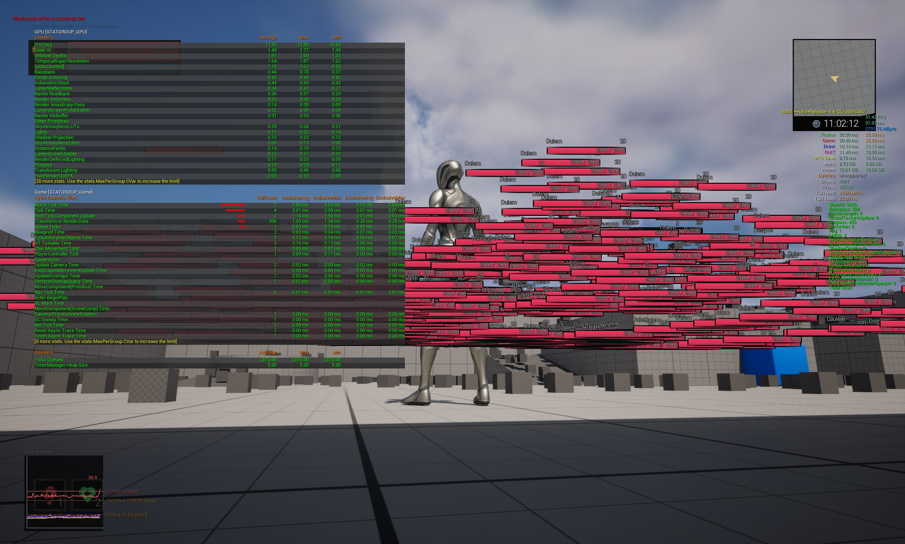

# UI Unreal Programmer - World of Warcraft UI

Developed with Unreal Engine 5


## Key Bindings

```
W,S,A,D -   Movement
SPACE   -   Jump (Consumes Mana)
1       -   Attack (Consumes Mana)  - Do damage to the target or player
2       -   Heal (Consumes Mana)    - Heals target or player
L       -   Toggle Minimap
B       -   Toggle Inventory
T       -   Select self
```

## Features

- [x] Main Menu - Separate Level (Map)

### Main Menu

- Main Menu is implemented as separate empty level, where different Game Mode is instantiated with a different  `AHUD`
  class.

### Gameplay

- Gameplay Mode is using a different `AHUD` class that has it's own root `GameplayLayoutWidget` with pre-defined
  `UNamedSlot` in which various UI widgets are placed.
- `MinimapWidget`, `Nameplate`, `UnitFrameWidget`, `QuestMenu`, `InventoryMenu`

- For easy access to the UI HUD - use `GlobalUtils::GetGameplayHUD`
- `GripTaskCharacter` is a main Player's Actor class that implements `ITargetInterface`, same does the dummy actor class
  for NPCs `TargetDummyActor`.
- Separate logic in `AttributeComponent` and `TargetComponent` inherited from `UActorComponent`.

#### Attribute Component

- Uses `FCharacterStats` structure to use data as template for proper initialization of the character stats.
- Can modify and notify changes related to Health and Mana.
- Also takes care of the actor's name, level.
- Periodical regeneration of mana (can be set in the FCharacterStats structure).

#### Target Component

- Used for Target management, reflects all the changes about the Target change and interactions with possible Actors
  that implements `ITargetInterface`.

---

- [x] In-Game Mouse Controls

Replace the default behavior by changing the enhanced input mapping. We should disable the default rotation towards
movement. 

```c++
// Don't rotate when the controller rotates. Let that just affect the camera.
bUseControllerRotationPitch = false;
bUseControllerRotationYaw = false;
bUseControllerRotationRoll = false;
```

---

- [x] UnitFrames

Pre-instantiated two widgets - Player and Target, both uses the same `ITargetInterface` for data passing. This allows
the UI to be udpated only when necessary and all related widgets to Target are binded to the delegates on the
`TargetComponent` or `AttributeComponent` of the Player/Target.

---

- [x] Nameplates

Dynamic widgets that are displayed when certain NPCs or Characters are nearby. Nameplates are used as `WidgetComponent`
on the `AActor` related classes and are updated through the `TargetComponent` callback only when necessary. No `Tick` is
used for updating the Nameplates.

- Active Nameplate is highlighted through the `TargetComponent` callback passed through the `GameplayHUD`. `GameplayHUD`
  caches the currently active Nameplate.

- I tried to profile the performance of the Nameplates and there seems to be no performance impact. 

---

- [x] Minimap

Permanent widget that represents a top down view of the current map with minimal graphic details. Minimap should be
rendering a separate camera view that is looking from the top to the player's position.

- Various properties are setup on the minimap to minimize the performance impact. No shadows, lights or postprocessing
  is applied. There could be probably more stuff disabled but for the sake of the demo, this is enough.

---

- [x] Quest Log

Permanent widget that represents the current quests that the player has. Quest Log should be updated only when the data
change and entries in the quest log should be pooled - this is resolved thanks to native implementation of `ListView`.
Entries are set through the `UQuestItemData` data class. Unfortunatelly the `ListView` does not allow `FTableRowBase`
structs as passed objects, expects `UObjects`.

- Uses `FQuestData` Data table for data.
- Various icons used, data are from STALKER.

---

- [ ] Inventory

Permanent widget that renders the UI Grid of the Current Player. Inventory is a logical data structure handled by
scripts. Player UI Inventory only represents the data.

**Tooltips should be also implemented. Display a tooltip when hovering on top of the item.**

UI Inventory should be updated only when the data changes.

The idea of implementing the Inventory System is split to two parts - UI and Data. The UI is only a representation of the data structure in some human readable form. Based on the complexity of inventory system, like slots, various grid sizes or just 1x1 slot size like in WoW. All these aspects lead to the further way how the inventory system is implemented. At this scenario, only 1x1 slot based inventory is desired so this could be achieved with some simple 2D array of `UInventorySlot` structure, that would contain data about `UInventoryItem` passed on the widget. Drag N Drop would be implemented through the `UDraggableWidget` class and all dragging actions are validated against the data layer so player is not able to drag the item to the wrong slot or to the wrong inventory.

This was not implemented due to time constraints.

---

- [ ] Drag and drop dialogs + Tooltips (OPTIONAL)

Implementation of the Drag n Drop has came to its limitation because I put majority of the widgets into the `UNamedSlot`
widgets. It would need a further re-implementation and proper parenting of the widget. As far as I understood, the
draggable widget should be anchored properly and attached to the `UCanvasPanel` widget class so it has free movement. I
didn't have much time to spend another time on this.

Pseudo-idea of the implementation:

- My idea was to create base class for `UUSerWidget` named `DraggableWidgetBase`. Layout should be aware of all these widgets and manage them based on the currently active `Draggable` so it can reparent and change the ZIndex of the dragged widget. 
- I spent too much time on investigating the Drag'n'Drop and because I use the NamedSlots that gives the limitation in size and position of the widget, I decided to not lose a lot of time on that. 
- Drag'n'Drop mechanic is quite complex thing and it can be achieved in many ways but for sake of this demo, I believe the explanation is just enough.

## Performance

I tried to spawn 408 actors and see the performance impact on the game. The game was still running smoothly around 30-40 FPS but on GTX3080 so It's not a good measure. The problem is not coming from the scripting part, but more from the rendering part, where all the progress bars and various widgets stack on top of each other cast draw calls on the GPU. I believe this could be handled better with some instanced materials or some other optimization techniques but I couldn't have a chance to look on that during this one week. 

Also a big performance impact would have some culling of the nameplates. This can be achieved by some distance check to the potential Targets and only render the Nameplates when they are in the certain range and no obstacle is blocking the view. 

All these optimization steps are not implemented in this demo due to time limitations but are taken into consideration.




## Conclusion

Since I started completely from scratch with almost no previous knowledge of Unreal Engine, this was a great learning
experience. 

Most important part of this task is to be careful about `NativeTick` of the ui widgets that can be overwhelming when not
used wisely.

Unreal Engine covers a lot of things automatically from the ground so it was really refreshing to see how much stuff is
already implemented and how much time it can save. UMG is very convenient comparing to the Unity's Legacy UI system. I am very curious about exploring some more advanced frameworks for the UI. 

Most annoying part was wasting couple hours on losing the reference in Blueprint class on certain `TargetComponent`.
For some reason the Unreal Engine when using `HotReload` cause issues to certain objects serialized in the editor. Also
`DataTables` cannot be changed when using HotReload. There were some other issues with the Editor and probably HotReload all together. I found out that it is much better to just build the project and sometimes restart the editor.

