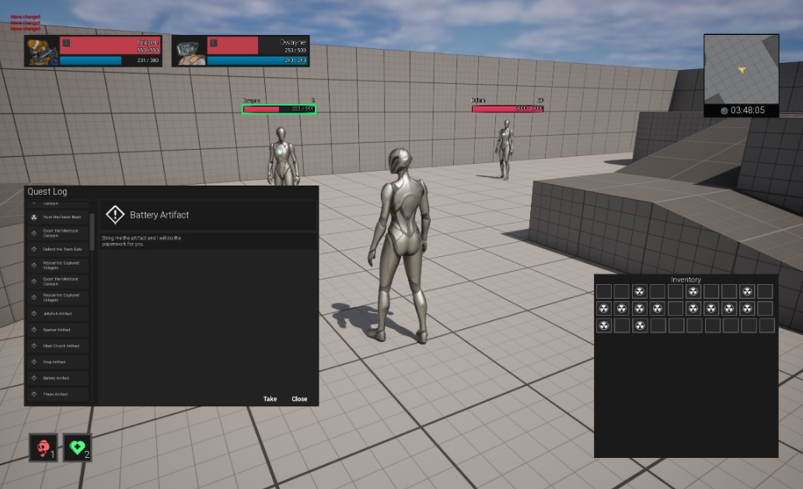

# UI Unreal Programmer - World of Warcraft UI

Developed with Unreal Engine 5



## Key Bindings

```
W,S,A,D -   Movement
SPACE   -   Jump (Consumes Mana)
1       -   Attack (Consumes Mana)  - Do damage to the target or player
2       -   Heal (Consumes Mana)    - Heals target or player
L       -   Toggle Minimap
B       -   Toggle Inventory
T       -   Select self
```

## Features

- [x] Main Menu - Separate Level (Map)

### Main Menu

- Main Menu is implemented as separate empty level, where different Game Mode is instantiated with a different  `AHUD`
  class.

### Gameplay

- Gameplay Mode is using a different `AHUD` class that has it's own root `GameplayLayoutWidget` with pre-defined
  `UNamedSlot` in which various UI widgets are placed.
- `MinimapWidget`, `Nameplate`, `UnitFrameWidget`, `QuestMenu`, `InventoryMenu`

- For easy access to the UI HUD - use `GlobalUtils::GetGameplayHUD`
- `GripTaskCharacter` is a main Player's Actor class that implements `ITargetInterface`, same does the dummy actor class
  for NPCs `TargetDummyActor`.
- Separate logic in `AttributeComponent` and `TargetComponent`

#### Attribute Component

- Uses `FCharacterStats` structure to use data as template for proper initialization of the character stats.
- Can modify and notify changes related to Health and Mana.
- Also takes care of the actor's name, level.
- Periodical regeneration of mana (can be set in the FCharacterStats structure).

#### Target Component

- Used for Target management, reflects all the changes about the Target change and interactions with possible Actors
  that implements `ITargetInterface`.

---

- [x] In-Game Mouse Controls

Replace the default behavior by changing the enhanced input mapping. We should disable the default rotation towards
movement.

---

- [x] UnitFrames

Pre-instantiated two widgets - Player and Target, both uses the same `ITargetInterface` for data passing. This allows
the UI to be udpated only when necessary and all related widgets to Target are binded to the delegates on the
`TargetComponent` or `AttributeComponent` of the Player/Target.

---

- [x] Nameplates

Dynamic widgets that are displayed when certain NPCs or Characters are nearby. Nameplates are used as `WidgetComponent`
on the `AActor` related classes and are updated through the `TargetComponent` callback only when necessary. No `Tick` is
used for updating the Nameplates.

- Active Nameplate is highlighted through the `TargetComponent` callback passed through the `GameplayHUD`. `GameplayHUD`
  caches the currently active Nameplate.

---

- [x] Minimap

Permanent widget that represents a top down view of the current map with minimal graphic details. Minimap should be
rendering a separate camera view that is looking from the top to the player's position.

- Various properties are setup on the minimap to minimize the performance impact. No shadows, lights or postprocessing
  is applied. There could be probably more stuff disabled but for the sake of the demo, this is enough.

---

- [x] Quest Log

Permanent widget that represents the current quests that the player has. Quest Log should be updated only when the data
change and entries in the quest log should be pooled - this is resolved thanks to native implementation of `ListView`.
Entries are set through the `UQuestItemData` data class. Unfortunatelly the `ListView` does not allow `FTableRowBase`
structs as passed objects, expects `UObjects`.

- Uses `FQuestData` Data table for data.
- Various icons used, data are from STALKER.

---

- [ ] Inventory

Permanent widget that renders the UI Grid of the Current Player. Inventory is a logical data structure handled by
scripts. Player UI Inventory only represents the data.

**Tooltips should be also implemented. Display a tooltip when hovering on top of the item.**

UI Inventory should be updated only when the data changes.

---

- [ ] Drag and drop dialogs + Tooltips (OPTIONAL)

Implementation of the Drag n Drop has came to its limitation because I put majority of the widgets into the `UNamedSlot`
widgets. It would need a further re-implementation and proper parenting of the widget. As far as I understood, the
draggable widget should be anchored properly and attached to the `UCanvasPanel` widget class so it has free movement. I
didn't have much time to spend another time on this.

Pseudo-idea of the implementation:

- Create a handler that takes care of the currently dragged element and detach the widgets from their slots, eventually
  expose a new draggable widget visual for the `UDraggableWidgetDragDropOperations` class.

## Conclusion

Since I started completely from scratch with almost no previous knowledge of Unreal Engine, this was a great learning
experience. I can confidently say, that this task would take me much less time in the Unity Engine but the general idea
is very similar.

Most important part of this task is to be careful about `NativeTick` of the ui widgets that can be overwhelming when not
used wisely.

Unreal Engine covers a lot of things automatically from the ground so it was really refreshing to see how much stuff is
already implemented and how much time it can save.

Most annoying part was wasting couple hours on loosing the reference in Blueprint class on certain `TargetComponent`.
For some reason the Unreal Engine when using `HotReload` cause issues to certain objects serialized in the editor. Also
`DataTables` cannot be changed when using HotReload. 